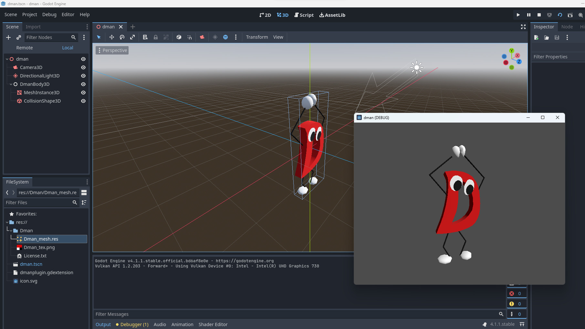

# dman-godot

OSSのゲームエンジン [Godot](https://godotengine.org/) のD言語向けバインディング [godot-dlang](https://github.com/godot-dlang/godot-dlang) を利用したデモです。

D言語くんがぐるぐる回転します。

モデルは、[うえしたさん作成のD言語くん](https://3d.nicovideo.jp/works/td28301)をインポートして使わせて頂いています。

## 動作環境

* Windows 11
* Windows版DMD v2.105.2 (同梱`dub`使用)
* Godot 4.1.1

## ビルド手順

ほぼ [godot-dlang](https://github.com/godot-dlang/godot-dlang) に記載されている手順です。<br>
一部Godot4向けに調整しています。

### Godot 4のダウンロード

以下のサイトからGodot 4をダウンロードします。

https://godotengine.org/

展開先等は任意です。デスクトップ上のフォルダ等でも問題ありません。

### `godot-dlang`のインストール

```powershell
$ dub fetch godot-dlang@~godot-4.1
```

Godot 4で利用する場合は `~godot-4.1` を指定するよう注意してください。

### GodotのAPI情報の出力

`godot-dlang` のバインディングライブラリビルド用のAPI情報をGodotから出力します。

```powershell
$ cd {Godot4展開フォルダ}
$ Godot_v4.1.1-stable_win64.exe --dump-extension-api

# ファイルができたことを確認
$ ls extension_api.json
```

`Godot_v4.1.1-stable_win64.exe`はダウンロード・展開したGodot実行ファイルです。ファイル名はバージョンにより異なる場合があります。

### `godot-dlang` によるバインディングライブラリのビルド

Godot4展開フォルダでそのまま作業をします。

```powershell
$ dub run godot-dlang@~godot-4.1:generator -- -j extension_api.json -o
```

こちらは `godot-dlang`を`dub fetch`した後やGodotをバージョンアップした後に1回だけ実行が必要です。

### 本プロジェクトのビルド

後は本プロジェクトがビルドできるはずです。

```powershell
# 本プロジェクトのフォルダに移動
$ cd ~/path-to-project/dman-godot

# ビルド実行
$ dub build

# 成功すれば dman-godot.dll ができるはず
$ ls dman-godot.dll
```

### Godotプロジェクトを開く

`project`ディレクトリ配下がGodotプロジェクトになっています。<br>
Godotを起動して、`Import Project`で`project`ディレクトリを選択してください。

### スクリーンショット



